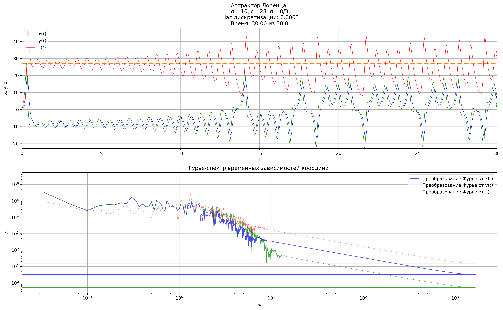
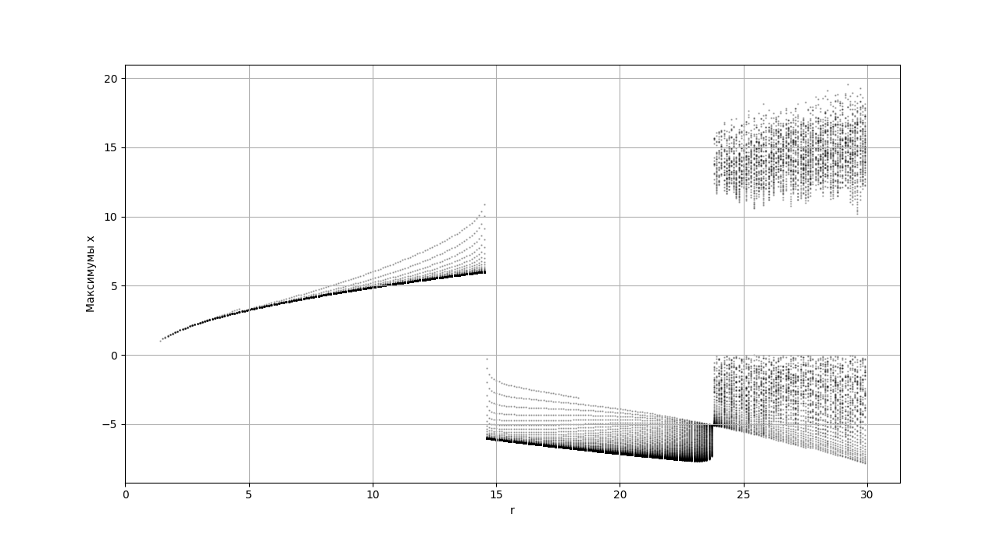
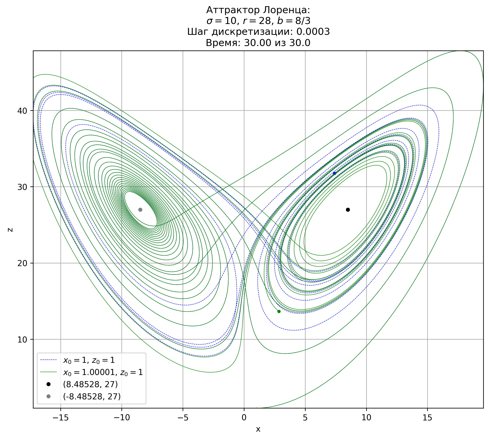

# Изучение аттрактора Лоренца с помощью численных методов

Численное исследование системы Лоренца с использованием метода Рунге–Кутты 4 порядка.

Проект включает:
- построение аттрактора Лоренца,
- анализ чувствительности к начальным условиям,
- FFT-анализ,
- построение бифуркационной диаграммы.

## Математическая модель

Система Лоренца:

$$
\dot{x} = \sigma(y - x)
$$

$$
\dot{y} = x(r - z) - y
$$

$$
\dot{z} = xy - bz
$$

Используемые параметры:

- $\sigma = 10$
- $r = 28$
- $b = 8/3$


### Решение и его фурье-спектр




### Бифуркационная диаграмма



### Бабочки



## Installation

```bash
git clone https://github.com/Kolya123F/AttractorLorentz.git
cd AttractorLorentz
pip install -r requirements.txt
```

---

## Используемые библиотеки

- Python
- NumPy
- SciPy
- Matplotlib

---

## Автор

Николай Тодоров

3 курс ФОПФ МФТИ